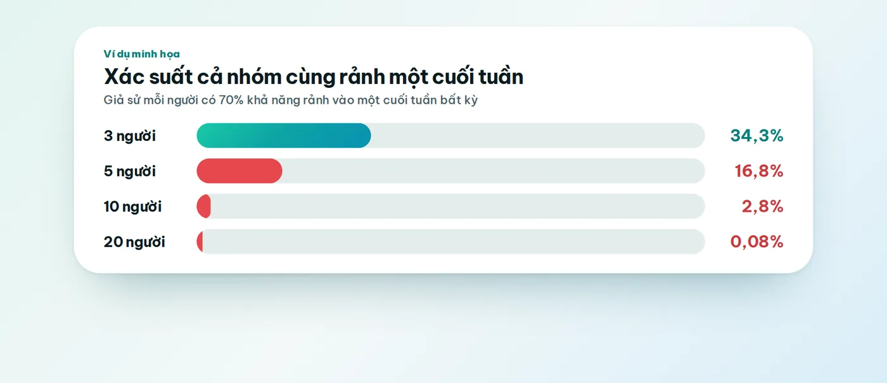
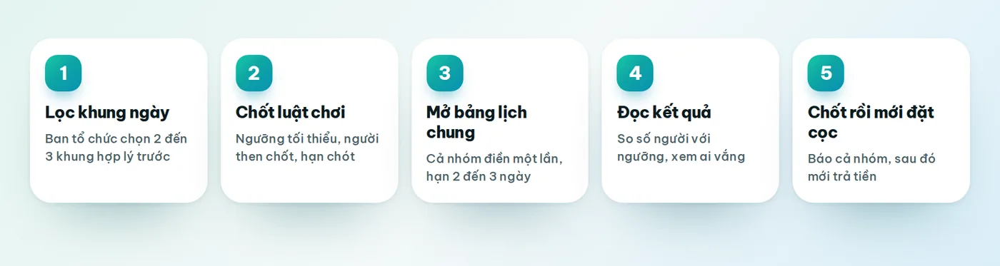
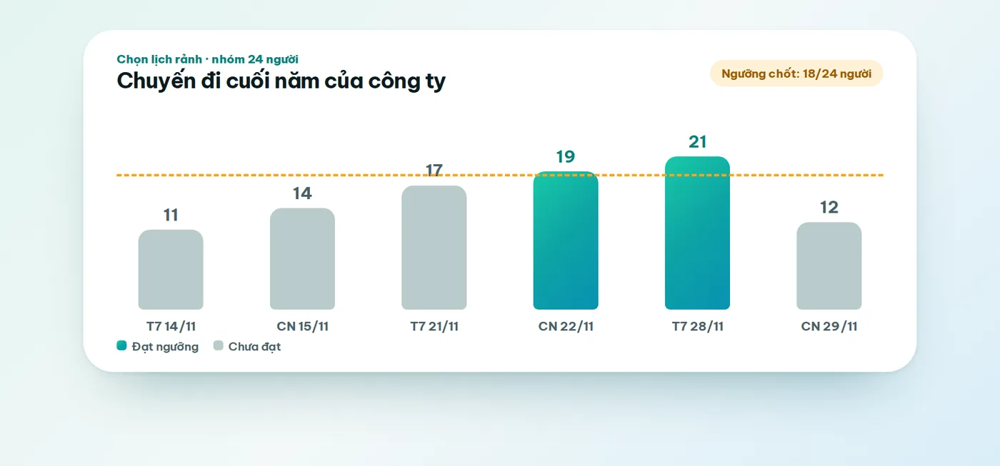
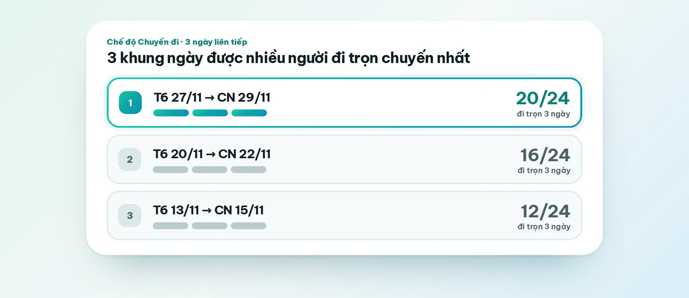

Rủ năm người đi chơi thì chỉ cần một buổi tối là chốt xong ngày. Rủ hai mươi lăm người thì chuyện hoàn toàn khác. Tin nhắn dồn lên như thác, người này hỏi "thứ Bảy được không", người kia ba hôm sau mới trả lời "tuần đó mình bận", và đến lúc ai đó nhớ ra chuyện đặt cọc thì cả nhóm vẫn chưa có lấy một ngày nào được gọi là đã chốt.

Nếu bạn đang loay hoay với cách chọn ngày đi chơi cho nhóm đông người, có một điều nên biết trước tiên: trong một nhóm lớn, gần như không bao giờ có ngày mà ai cũng rảnh. Vì vậy việc cần làm không phải là đi tìm ngày hoàn hảo, mà là thống nhất với nhau cách quyết định ngay từ đầu. Bài này chia sẻ một quy trình bạn có thể áp dụng cho chuyến du lịch công ty, buổi họp lớp, chuyến về quê của đại gia đình hay một hội bạn đông đảo, kèm cách dùng bảng lịch rảnh chung để mọi chuyện đỡ đau đầu hơn. Vote Đi, công cụ xuất hiện ở phần giữa bài, là web do chính chúng mình làm, nên bạn cứ đọc phần đó với con mắt tỉnh táo nhé.

## Vì sao chọn ngày cho nhóm đông người khó hơn nhiều so với nhóm nhỏ

Nhiều người nghĩ nhóm đông chỉ là nhóm nhỏ nhân lên, nên cách làm cũng giống như vậy, chỉ cần kiên nhẫn hơn. Thực tế thì độ khó tăng lên theo kiểu khác hẳn, và có ba lý do chính khiến việc chọn ngày cho nhóm lớn dễ biến thành một cuộc "chiến tranh lạnh" trong nhóm chat.

### Gần như không bao giờ có ngày ai cũng rảnh

Hãy thử một phép tính đơn giản. Giả sử mỗi người trong nhóm có 70% khả năng rảnh vào một cuối tuần bất kỳ, một con số nghe khá dễ chịu. Với nhóm ba người, xác suất cả ba cùng rảnh vào cuối tuần đó là khoảng 34%, tức là cứ ba cuối tuần thì có một cuối tuần dùng được. Nhóm mười người chỉ còn khoảng 2,8%. Còn nhóm hai mươi người thì xuống dưới 0,1%, nghĩa là bạn có thể chờ rất lâu mà vẫn không gặp được một cuối tuần nào mà tất cả đều rảnh.

Đây chỉ là phép tính minh họa, coi như việc rảnh của mỗi người độc lập với nhau, nhưng nó giải thích rất đúng cảm giác "sao mãi không tìm được ngày" mà người tổ chức nào cũng từng gặp. Hệ quả là câu hỏi "ai cũng rảnh ngày nào?" sẽ không bao giờ có đáp án. Câu hỏi đúng phải là "ngày nào có đủ số người cần thiết?".

### Người nói to thắng, người im lặng thua

Trong nhóm chat đông, người trả lời đầu tiên thường quyết định luôn hướng đi của cả cuộc thảo luận. Ai nêu một ngày trước, những người sau có xu hướng gật theo cho xong chuyện, còn người thật sự không rảnh lại ngại lên tiếng vì không muốn làm cả nhóm mất vui. Đến lúc chốt, bạn mới phát hiện mười người im lặng nãy giờ đều bận đúng ngày đó. Ở nhóm nhỏ, bạn chỉ cần nhắn riêng vài người là xong, còn ở nhóm đông, bạn cần một cơ chế để ai cũng trả lời được, chứ không chỉ những người hay lên tiếng.

### Chốt muộn thì mất tiền

Chuyến đi của nhóm đông thường kéo theo những khoản phải trả sớm, như đặt cọc xe, homestay, nhà hàng hay vé tham quan theo đoàn. Nhóm càng đông thì việc đổi ngày càng tốn kém, vì phải hỏi lại từng nơi và báo lại từng người. Cho nên chọn ngày ở đây còn là chuyện tiền bạc, chứ không đơn thuần là chuyện làm vừa lòng cả nhóm. Một ngày được chốt cẩn thận hôm nay có thể giúp bạn khỏi phải xin lại tiền cọc hai tuần sau.

## Cách chọn ngày đi chơi cho nhóm đông người: quy trình 5 bước

Dưới đây là quy trình chúng mình thấy ổn nhất cho nhóm từ khoảng mười người trở lên. Nhóm nhỏ hơn thì bạn có thể rút gọn một vài bước, hoặc xem thêm bài [cách chọn ngày đi chơi, họp lớp cả nhóm không cãi nhau](/blog/chon-ngay-di-choi-hop-lop-ca-nhom) dành cho những nhóm vừa và nhỏ.

### Bước 1: Ban tổ chức lọc trước vài khung ngày

Đừng ném cả tháng vào nhóm rồi hỏi "mọi người rảnh ngày nào". Với nhóm đông, hãy để ba, bốn người trong ban tổ chức ngồi lại trước và loại bỏ những khung ngày chắc chắn không hợp, chẳng hạn dịp cao điểm khiến giá vé và phòng đắt đỏ, tuần có kỳ thi hay đợt quyết toán của công ty, hoặc mùa mưa bão nếu bạn định đi biển. Sau đó đưa cho cả nhóm hai hoặc ba khung đã qua sàng lọc, thay vì để họ tự mò trong một đống lựa chọn. Ít lựa chọn thì người ta trả lời nhanh hơn, và bảng kết quả cũng dễ đọc hơn nhiều.

### Bước 2: Chốt luật chơi trước khi hỏi

Đây là bước mà nhóm nào bỏ qua cũng phải trả giá. Trước khi hỏi bất cứ ai, bạn cần thống nhất bốn điều: ngưỡng tối thiểu để một ngày được coi là đạt (ví dụ ít nhất ba phần tư nhóm đi được), những người then chốt không thể thiếu (trưởng đoàn, người giữ quỹ, chủ xe...), hạn chót trả lời, và ai là người có quyền quyết khi hai ngày bằng điểm nhau. Hãy nói điều này công khai với cả nhóm bằng một tin nhắn ngắn, ví dụ:

> Mình sẽ chốt ngày nào có ít nhất 75% nhóm đi được. Mọi người trả lời giúp mình trước tối thứ Năm nhé. Hết hạn mà chưa trả lời thì mình tính là chưa đi được ngày đó.

Biết luật từ đầu thì sau này ít ai phản đối, vì chính họ đã đồng ý với cách tính. Bảng dưới gợi ý cách xử lý những tình huống thường gặp khi đọc kết quả.

| Tình huống khi đọc kết quả | Nên làm |
|---|---|
| Có một ngày đạt ngưỡng, không thiếu người then chốt | Chốt ngày đó |
| Có nhiều ngày đạt ngưỡng | Ưu tiên ngày nhiều người nhất, rồi xem ai vắng trước khi quyết |
| Hai ngày bằng số người | Chọn ngày có đủ người then chốt, nếu vẫn bằng nhau thì người có quyền chốt quyết |
| Ngày đạt ngưỡng nhưng vắng người then chốt | Chưa chốt vội, hỏi riêng người đó hoặc xét ngày kế tiếp |
| Không ngày nào đạt ngưỡng | Xem phần "Khi không có ngày nào đủ người" bên dưới |

### Bước 3: Mở bảng lịch chung để cả nhóm điền một lần

Thay vì hỏi từng người, hãy cho cả nhóm điền vào một bảng chung. Mỗi người chỉ cần đánh dấu những ngày hoặc buổi mình đi được, còn việc cộng lại để bảng tự làm. Bạn nên cho ba mức trả lời là Rảnh, Có thể và Bận, vì rất nhiều người ở trạng thái "chắc là được, nhưng chờ xem lịch trực", và nếu chỉ có hai nút thì họ sẽ trả lời bừa hoặc bỏ qua luôn. Hạn trả lời nên ngắn, khoảng hai đến ba ngày, đủ để người bận kịp vào mà vẫn đủ gấp để không ai quên.

Với nhóm đông, việc nhắc người chưa trả lời quan trọng ngang với việc làm bảng. Cách hiệu quả là chia nhóm thành các nhóm nhỏ khoảng sáu đến tám người, mỗi nhóm nhờ một bạn làm đầu mối. Một tin nhắn riêng kiểu "bạn điền giúp mình nha, chỉ mất một phút" có tác dụng hơn rất nhiều so với mười lần nhắc chung trong nhóm lớn.

### Bước 4: Đọc kết quả bằng ngưỡng, đừng đọc bằng cảm tính

Khi mọi người trả lời xong, hãy nhìn số người ở từng ngày và so với ngưỡng đã đặt từ trước. Ở ví dụ dưới, nhóm 24 người đặt ngưỡng 18 người, tức 75%. Hai ngày Chủ nhật 22/11 và Thứ Bảy 28/11 đạt ngưỡng, các ngày còn lại thì chưa. Nhìn bằng mắt thường, bạn thấy ngay đâu là ứng viên, khỏi cần ngồi đếm từng người trong đoạn chat.

Sau đó, hãy xem thêm ai vắng ở những ngày đạt ngưỡng. Nếu người vắng lại là người then chốt, chẳng hạn trưởng đoàn hay người cầm quỹ, thì ngày đông nhất chưa chắc là ngày tốt nhất. Đây cũng là lý do bạn nên đặt luật về người then chốt ngay từ bước hai.

### Bước 5: Chốt xong rồi mới đặt cọc

Nghe thì hiển nhiên, nhưng rất nhiều nhóm làm ngược: có bạn nhiệt tình đặt cọc xe trước "cho chắc chỗ", rồi mới hỏi ngày. Hãy giữ kỷ luật theo thứ tự này: chốt ngày, thông báo cho cả nhóm kèm ảnh chụp bảng kết quả, để họ vài giờ phản hồi nếu ai có vướng mắc, và chỉ sau đó mới trả tiền. Với những người không đi được ngày đã chốt, hãy nhắn riêng hỏi xem họ có muốn đi theo cách khác không, như đi muộn một ngày hay về sớm, thay vì để họ lặng lẽ rút khỏi chuyến đi.

## Chọn ngày du lịch nhiều ngày: tìm khung ngày liên tiếp

Chuyến đi từ hai ngày trở lên có thêm một rắc rối mà chuyến đi trong ngày không có. Thứ bạn cần tìm không phải một ngày lẻ mà là cả một khung ngày liên tiếp, và chỉ cần ai đó rảnh thứ Sáu, thứ Bảy nhưng bận Chủ nhật là người đó đã không đi trọn chuyến rồi. Nếu đếm bằng tay, việc dò ra khung ngày nhiều người đi trọn vẹn nhất gần như là bất khả thi với nhóm vài chục người.

Chế độ **Chuyến đi** của Vote Đi sinh ra cho đúng việc này. Bạn chọn số ngày của chuyến đi, mỗi người tô những ngày mình đi được, và hệ thống tự tìm các khung ngày liên tiếp có nhiều người đi trọn chuyến nhất, rồi liệt kê ba khung đứng đầu sao cho không chồng lên nhau. Ví dụ nhóm 24 người định đi ba ngày sẽ nhìn thấy kết quả giống như hình dưới.

## Dùng Vote Đi để chốt ngày cho nhóm đông

Vote Đi là web tạo vote cho nhóm chạy ngay trên trình duyệt điện thoại hoặc máy tính, trong đó có kiểu vote **Chọn lịch rảnh** làm đúng việc ở bước ba và bước bốn phía trên. Cả nhóm không cần tạo tài khoản. Cách làm như sau.

1. Vào [mẫu Chọn ngày đi du lịch](/mau/chon-ngay-di-du-lich), bấm dùng mẫu và đặt tên phòng, ví dụ "Chuyến đi cuối năm của công ty".
2. Chọn chế độ phù hợp: theo ngày, theo buổi, theo khung giờ, hoặc chế độ Chuyến đi nếu bạn cần khung nhiều ngày liên tiếp.
3. Gửi link vào nhóm Zalo. Ai bấm vào chỉ cần đặt tên và chọn avatar là vào được.
4. Mỗi người trả lời bằng thẻ **Trả lời nhanh**: chạm Bận, Có thể hoặc Rảnh, thẻ tự chuyển sang buổi kế tiếp.
5. Xem lưới lịch cả nhóm cùng top 3 khung đẹp nhất, đối chiếu với ngưỡng bạn đã đặt, rồi bấm **Chốt**. Sau đó bạn thêm sự kiện vào Google Calendar hoặc tải file lịch (.ics), và nếu cần điều chỉnh thì mở lại phòng.

Có một điểm đánh đổi bạn nên cân nhắc. Vote Đi có chế độ ẩn danh, và khi bật thì không ai thấy ai chọn gì, bạn chỉ thấy số lượng tổng hợp. Chế độ này rất tốt khi bạn muốn mọi người trả lời thật lòng, nhưng cũng có nghĩa bạn không biết người then chốt có đi được hay không. Vì vậy, nếu chuyến đi phụ thuộc vào vài người cụ thể, hãy để chế độ công khai, hoặc nhờ họ báo riêng cho bạn.

Chúng mình cũng nói thẳng vài giới hạn. Vote Đi chạy trên trình duyệt, chưa có ứng dụng riêng. Việc nhắc những người chưa trả lời vẫn là việc của bạn và các bạn đầu mối. Công cụ này cũng không đặt xe hay thu tiền hộ, nó chỉ giúp bạn chốt ngày nhanh và rõ ràng.

<TemplateCta slug="chon-ngay-di-du-lich" />

## Khi không có ngày nào đủ người, bạn còn những cách nào

Đôi khi bảng kết quả cho thấy không ngày nào chạm ngưỡng. Đừng hoảng, vì đó là chuyện bình thường với nhóm lớn, và bạn vẫn còn mấy hướng xử lý.

**Chia thành hai đợt.** Nếu nhóm quá đông hoặc lịch quá rời rạc, hãy để mỗi đợt đi một nhóm riêng. Cách này tốn công tổ chức hơn nhưng giữ được chuyến đi mà không ai phải ngậm ngùi nhường.

**Dời hoặc mở rộng khung ngày.** Thử thêm một hai cuối tuần nữa hoặc đổi sang ngày thường. Nhóm công ty thường dễ chốt hơn khi cả nhóm được nghỉ phép chính thức, thay vì cố tranh một cuối tuần.

**Hạ ngưỡng có điều kiện.** Bạn có thể giảm ngưỡng từ 75% xuống 65%, nhưng hãy làm điều đó công khai và kèm điều kiện, ví dụ người then chốt phải đi đủ. Đừng lặng lẽ hạ ngưỡng sau khi thấy kết quả, vì người ta sẽ có cảm giác luật chơi bị đổi giữa chừng.

**Thu nhỏ chuyến đi.** Một chuyến hai ngày một đêm đôi khi dễ chốt hơn chuyến ba ngày, vì ít người phải xin nghỉ hơn. Nếu mục đích chính là gặp nhau, rút ngắn thời gian là một lựa chọn rất đáng cân nhắc.

## Mẹo riêng cho từng kiểu nhóm đông

### Họp lớp

Họp lớp thường có người ở xa nên cần thời gian sắp xếp, vì vậy hãy hỏi sớm ba đến bốn tuần. Nhờ vài bạn trong ban cán sự cũ làm đầu mối nhắc từng nhóm nhỏ, và tránh dịp lễ hay mùa cưới nếu có thể. Bạn có thể bắt đầu từ [mẫu Chọn ngày họp lớp](/mau/chon-ngay-hop-lop).

### Công ty và teambuilding

Với công ty, hãy gắn chuyến đi vào lịch nghỉ phép và các mốc quyết toán, vì đó là thứ quyết định ai thực sự đi được. Nên có một người ở bộ phận nhân sự làm người chốt cuối để tránh chuyện mỗi phòng ban một ý. [Mẫu Chọn ngày teambuilding](/mau/chon-ngay-teambuilding) được làm sẵn cho trường hợp này.

### Đại gia đình và họ hàng

Chuyến đi gia đình khó ở chỗ có người lớn tuổi và trẻ nhỏ, nên lịch học của các cháu và sức khỏe của ông bà thường là yếu tố quyết định. Hãy hỏi trước những người lớn tuổi, vì khó đổi lịch của họ hơn lịch của người trẻ. Với người không quen dùng điện thoại thông minh, bạn hoặc con cháu có thể gọi điện hỏi rồi điền hộ vào bảng, chứ đừng bắt họ tự học cách dùng một công cụ mới.

## Những lỗi hay gặp khi chọn ngày cho nhóm đông

**Hỏi quá rộng.** Câu "tháng này ai rảnh ngày nào?" sẽ cho bạn một đống câu trả lời rời rạc không ghép lại được. Hãy đưa sẵn hai, ba khung ngày đã lọc.

**Không đặt luật trước.** Nhóm nào chưa nói rõ ngưỡng và người then chốt thì lúc nhìn kết quả sẽ cãi nhau, vì mỗi người đang hiểu "đủ người" theo một nghĩa riêng.

**Chờ tất cả trả lời mới chốt.** Trong nhóm đông, luôn có vài người trả lời rất muộn hoặc không bao giờ trả lời. Hãy đặt hạn và ghi rõ là hết hạn thì tính theo những gì đã có.

**Đặt cọc trước khi chốt ngày.** Một khoản cọc đã đóng sẽ khiến mọi người ngại đổi, và nhiều khi ngày đó vốn dĩ không hợp với đa số.

**Chốt xong không báo lại.** Một tấm ảnh chụp kết quả gửi vào nhóm chỉ mất vài giây, nhưng tránh được những câu hỏi kiểu "rồi cuối cùng mình đi hôm nào vậy" xuất hiện suốt hai tuần sau đó.

## Câu hỏi thường gặp

### Nhóm bao nhiêu người thì nên dùng bảng lịch rảnh chung?

Từ khoảng tám đến mười người trở lên, việc hỏi từng người trong chat bắt đầu trở nên rối, vì câu trả lời trôi đi và không ai có bức tranh chung. Nhóm nhỏ hơn vẫn nên dùng bảng nếu có nhiều ngày để chọn, còn nhóm hai ba người thì nhắn tin là đủ.

### Cách chọn ngày đi chơi khi không thể ai cũng rảnh là gì?

Hãy đặt ngưỡng tối thiểu từ đầu, ví dụ ba phần tư nhóm, rồi chọn ngày nào đạt ngưỡng và có đủ người then chốt. Đừng cố tìm ngày tất cả cùng rảnh, vì với nhóm đông điều đó gần như không tồn tại.

### Nên hỏi ngày trước chuyến đi bao lâu?

Với nhóm đông, càng sớm càng tốt. Chúng mình thường gợi ý hỏi khoảng bốn đến sáu tuần trước chuyến đi, cộng thêm thời gian bạn cần để đặt xe, phòng hay nhà hàng. Con số này còn tùy vào điểm đến và mùa, nên dịp cao điểm bạn nên hỏi sớm hơn nữa.

### Chốt theo số đông hay theo người quan trọng?

Nên kết hợp cả hai. Ngày phải đạt ngưỡng về số người, đồng thời không được thiếu những người then chốt mà chuyến đi không thể thiếu. Hai điều này nên được thống nhất từ trước khi vote.

### Có nên cho phép đổi ý sau khi đã chốt?

Bạn có thể cho phép trong một khoảng ngắn trước khi đặt cọc, ví dụ vài giờ hoặc một ngày. Sau khi đã đặt cọc thì nên coi như khóa, để chuyến đi không bị xáo trộn liên tục.

### Người lớn tuổi không rành công nghệ thì làm sao?

Bạn hoặc một người thân gọi điện hỏi rồi điền hộ vào bảng. Cách này nhanh hơn nhiều so với việc hướng dẫn họ dùng một công cụ mới, và cũng tránh để họ cảm thấy bị bỏ lại.

### Cả nhóm có phải tạo tài khoản Vote Đi không, và có mất phí không?

Không cần tài khoản. Mỗi người bấm link mời, đặt tên và chọn avatar là vào được. Vote Đi miễn phí, bạn tạo phòng, mời người và vote mà không mất phí.

## Bắt đầu chốt ngày cho nhóm của bạn

Cách chọn ngày đi chơi cho nhóm đông người thật ra không quá khó, nếu bạn thống nhất luật chơi từ đầu và để cả nhóm điền vào một bảng chung. Hãy thử với chuyến đi sắp tới của bạn: tạo phòng mất chưa tới một phút, gửi link vào nhóm, rồi để bảng cho bạn thấy đâu là ngày đủ người. Nếu nhóm bạn cần cả chọn địa điểm lẫn mẫu áo cho chuyến đi, hai bài [web tạo vote cho nhóm: chọn áo, chốt ngày rảnh](/blog/web-tao-vote-cho-nhom-chon-ao-chot-ngay-ranh) và [cách tạo cuộc thăm dò ý kiến online](/blog/cach-tao-cuoc-tham-do-y-kien-online) sẽ giúp bạn đi tiếp.

<TemplateCta slug="chon-ngay-di-du-lich" />
