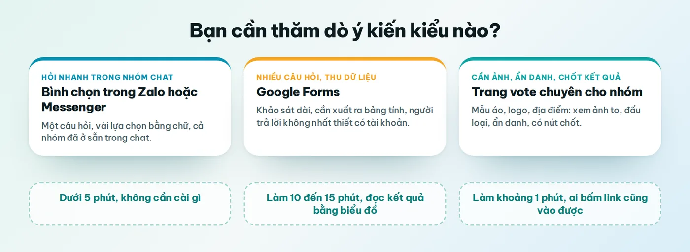
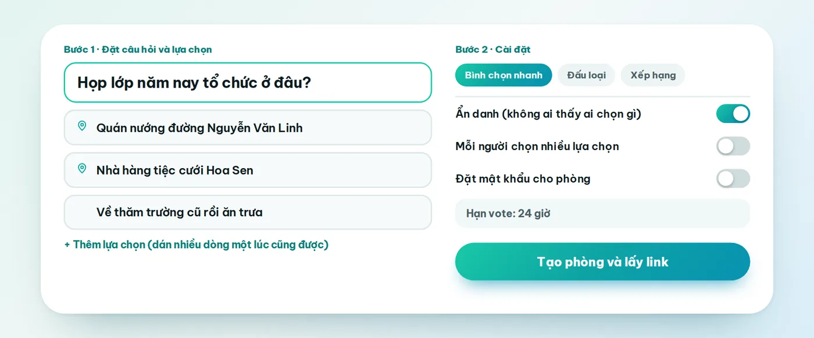
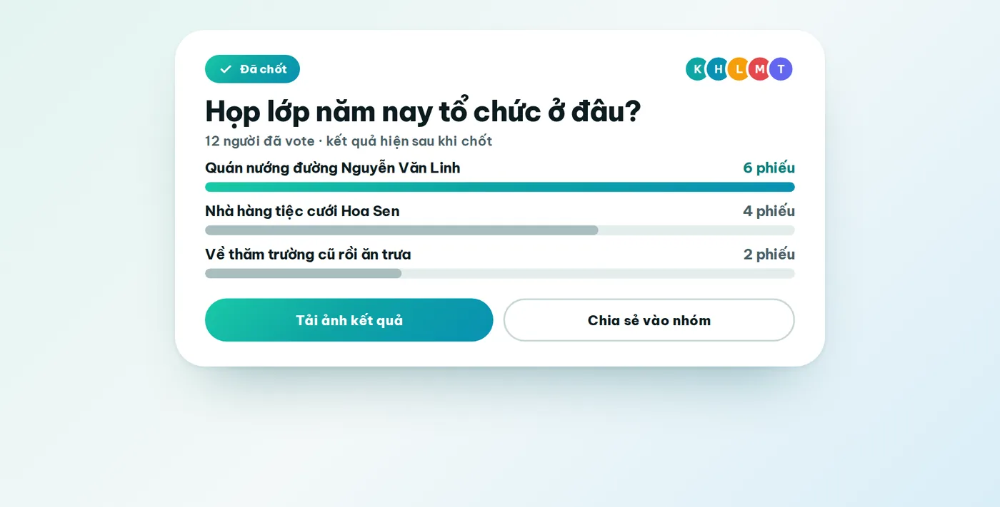
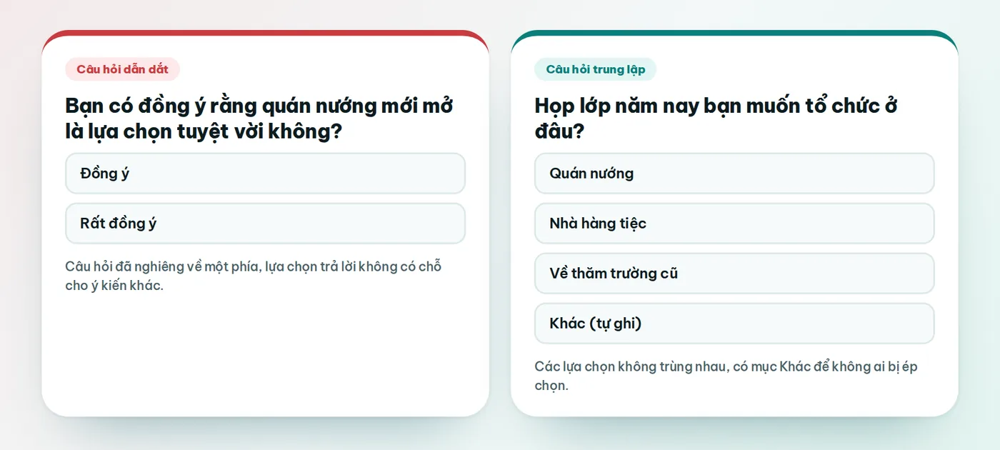

Có những lúc bạn cần biết cả nhóm nghĩ gì, nhưng nhắn riêng từng người thì vừa mệt vừa dễ sót. Lớp muốn chọn nơi họp mặt, đội bóng cần chốt giờ đá, công ty hỏi xem nên tổ chức tiệc cuối năm ở đâu, hay đơn giản là một nhóm bạn đang chưa biết tối nay ăn gì. Khi đó, một cuộc thăm dò ý kiến online sẽ gom mọi câu trả lời vào một chỗ, và bạn chỉ cần nhìn con số thay vì đọc lại hàng trăm tin nhắn.

Bài này hướng dẫn cách tạo cuộc thăm dò ý kiến online bằng sáu cách, từ những thứ có sẵn trong điện thoại như Messenger, Facebook, Zalo cho đến Google Forms và các trang chuyên làm bình chọn. Chúng mình đi từng bước cho mỗi cách, nói thật chỗ nào tiện và chỗ nào vướng, rồi chia sẻ vài kinh nghiệm viết câu hỏi để kết quả không bị lệch. Một lưu ý nhỏ: Vote Đi, web nằm ở cách số sáu, là sản phẩm của chính chúng mình, nên bạn cứ đọc phần đó với con mắt tỉnh táo.

## Thăm dò ý kiến online là gì, và khác khảo sát ở đâu

Một cuộc thăm dò ý kiến (hay bình chọn, poll) thường chỉ có một câu hỏi và vài lựa chọn để người ta bấm. Mục đích của nó là giúp một nhóm quyết định nhanh, nên kết quả thường có sau vài giờ, thậm chí vài phút. Khảo sát thì dài hơn: nhiều câu hỏi, nhiều dạng trả lời, và người làm cần phân tích dữ liệu sau đó.

Cách gọi cũng hơi lộn xộn. Messenger và Facebook gọi tính năng này là "Tạo cuộc thăm dò ý kiến", còn Zalo gọi là "Tạo bình chọn". Dù tên khác nhau, ý đồ vẫn là một: hỏi cả nhóm và đếm xem mọi người chọn gì. Bài này tập trung vào thăm dò nhanh, và sẽ chỉ ra lúc nào bạn nên chuyển sang dạng khảo sát dài như Google Forms.

## Trước khi tạo, hãy nghĩ rõ bốn điều

Phần lớn những cuộc thăm dò thất bại không phải vì công cụ kém mà vì người làm chưa nghĩ kỹ trước khi bấm tạo. Mất hai phút cho bốn câu hỏi dưới đây sẽ tiết kiệm cho bạn rất nhiều rắc rối về sau.

### Bạn cần quyết định điều gì sau cuộc thăm dò

Hãy viết ra một câu: "Sau khi có kết quả, mình sẽ làm gì?". Nếu câu trả lời là "chốt nơi họp lớp", cuộc thăm dò cần có những địa điểm thật sự khả thi. Nếu bạn chỉ tò mò xem mọi người nghĩ gì thì không sao, nhưng đừng hứa với cả nhóm là sẽ làm theo kết quả khi chính bạn chưa chắc.

### Ai sẽ trả lời, và họ đang dùng ứng dụng nào

Nhóm bạn thân vốn đã sống trên Zalo thì bình chọn ngay trong nhóm là hợp lý nhất. Nhưng nếu người trả lời nằm rải rác ở nhiều nơi, chẳng hạn phụ huynh ở Zalo, học sinh ở Messenger, thầy cô thì chỉ dùng email, thì một đường link mở được trên trình duyệt sẽ với tới tất cả mọi người. Cứ tự hỏi: người ngại công nghệ nhất trong nhóm sẽ trả lời bằng cách nào?

### Có cần ẩn danh không

Khi chủ đề nhạy cảm, hoặc trong nhóm có người lớn tuổi, cấp trên, thầy cô, phiếu công khai thường kéo kết quả nghiêng về phía họ. Nếu bạn muốn nghe ý kiến thật, hãy chọn công cụ có chế độ ẩn danh ngay từ đầu, vì đổi giữa chừng sẽ khiến người ta nghi ngờ.

### Khi nào đóng, và ai là người chốt

Hãy đặt hạn, thường là vài giờ cho chuyện gấp và một đến hai ngày cho chuyện cần cả nhóm kịp xem. Đồng thời nói rõ trước rằng khi các phương án bằng điểm nhau thì một người cụ thể sẽ quyết. Biết luật chơi từ đầu thì sau đó ít ai phản đối.

## Sáu cách tạo cuộc thăm dò ý kiến online

Giao diện của các ứng dụng đổi theo từng phiên bản, vị trí nút có thể khác một chút so với những gì bạn thấy dưới đây. Nhưng trình tự thì gần như không đổi: nhập câu hỏi, thêm lựa chọn, đăng, rồi chờ mọi người trả lời.

### 1. Tạo cuộc thăm dò trong nhóm Messenger

Theo các trang hướng dẫn, Messenger chỉ cho tạo cuộc thăm dò trong nhóm chat từ ba người trở lên, và thành viên trong nhóm có thể tự thêm lựa chọn mới vào cuộc thăm dò của bạn.

1. Mở Messenger và vào nhóm chat cần hỏi ý kiến.
2. Chạm vào dấu cộng, hoặc biểu tượng bốn chấm trên một số máy Android.
3. Chọn "Thăm dò ý kiến". Trên iPhone, mục này đôi khi nằm trong phần "Bình chọn".
4. Nhập câu hỏi, rồi nhập từng lựa chọn. Bấm "Thêm tùy chọn" nếu cần nhiều hơn.
5. Bấm "Tạo cuộc thăm dò ý kiến" để gửi vào nhóm.

Cách này nhanh và không phải mời ai thêm, nhưng cuộc thăm dò chỉ sống trong nhóm chat đó. Nhiều trang hướng dẫn cũng cho biết sau khi tạo xong bạn chưa xóa được cuộc thăm dò, nên hãy đọc lại câu hỏi và các lựa chọn một lượt trước khi bấm gửi.

### 2. Tạo thăm dò ý kiến trên Facebook

Facebook cho đăng thăm dò ý kiến ngay trong bài viết của nhóm, và với một số tài khoản thì có cả trên trang cá nhân. Tùy tài khoản và phiên bản, có nơi bạn thấy tính năng này, có nơi thì không.

1. Vào nhóm Facebook mà bạn muốn hỏi ý kiến.
2. Bấm vào ô "Bạn viết gì đi" để soạn bài.
3. Chọn "Thăm dò ý kiến". Nếu không thấy ngay, hãy mở dấu ba chấm hoặc mục "Thêm vào bài viết của bạn".
4. Nhập câu hỏi và các lựa chọn.
5. Bấm "Đăng".

Facebook hợp khi bạn muốn hỏi một cộng đồng đông người, như nhóm sở thích hay nhóm cư dân. Còn nếu bạn chỉ muốn hỏi bạn bè trong vài giờ, đăng thăm dò lên Tin (Story) cũng được, vì bài sẽ tự biến mất sau 24 giờ. Kết quả trên Facebook chỉ nên coi là ý kiến tham khảo, vì người xem là ai và có bấm hay không phụ thuộc rất nhiều vào thuật toán.

### 3. Tạo bình chọn trong nhóm Zalo

Với người Việt, Zalo là nơi nhiều nhóm lớp, nhóm đội, nhóm gia đình đang sống, nên bình chọn trong Zalo thường là lựa chọn đầu tiên.

1. Mở nhóm chat Zalo cần hỏi ý kiến.
2. Bấm vào biểu tượng bình chọn (hình biểu đồ) ở khung soạn tin, sau đó chọn "Tạo bình chọn".
3. Nhập chủ đề bình chọn, tức là câu hỏi của bạn.
4. Nhập các lựa chọn, bấm "Thêm lựa chọn" nếu cần thêm.
5. Bật hoặc tắt các tùy chọn: ẩn người bình chọn, ẩn kết quả khi chưa bình chọn, cho chọn nhiều phương án, cho thành viên thêm phương án.
6. Bấm "Tạo". Khi muốn kết thúc, bạn khóa bình chọn để không ai bình chọn thêm được nữa.

Điểm mạnh của Zalo là ai cũng đã có sẵn và có sẵn chế độ ẩn người bình chọn. Điểm cần cân nhắc là các lựa chọn chỉ là dòng chữ ngắn và số phương án có giới hạn (một số trang hướng dẫn ghi khoảng mười), nên đừng cố nhét cả danh sách dài vào đó.

### 4. Dùng Google Forms

Google Forms miễn phí và hợp nhất khi bạn cần hỏi nhiều câu hoặc cần dữ liệu xuất ra bảng tính. Người tạo cần tài khoản Google, còn người trả lời thì thường chỉ cần mở link.

1. Vào forms.google.com và chọn "Biểu mẫu trống".
2. Đặt tên cho biểu mẫu, rồi nhập câu hỏi đầu tiên.
3. Chọn dạng "Trắc nghiệm" nếu mỗi người chỉ chọn một đáp án, hoặc "Hộp kiểm" nếu cho chọn nhiều. Thêm các lựa chọn bên dưới, có thể chèn cả ảnh.
4. Bật "Bắt buộc" cho những câu cần trả lời.
5. Bấm "Gửi", chọn biểu tượng liên kết, sao chép link rồi gửi vào nhóm.
6. Xem kết quả ở thẻ "Câu trả lời". Google tự vẽ biểu đồ, và bạn có thể xuất sang Google Sheets để làm tiếp.

Nếu muốn mỗi người chỉ trả lời một lần, bạn bật giới hạn một phản hồi, nhưng khi đó người trả lời phải đăng nhập tài khoản Google. Điểm yếu của Forms với một cuộc thăm dò nhóm là thiếu không khí chung: người ta điền xong rồi đóng, và không thấy ai khác đã chọn gì, trừ khi bạn bật cho người trả lời xem kết quả tóm tắt.

### 5. Dùng trang tạo poll chuyên dụng

Có khá nhiều trang chỉ làm đúng một việc là tạo poll, như StrawPoll, EasyPolls hay SurveyMonkey. Cách làm của chúng rất giống nhau: nhập câu hỏi, nhập lựa chọn, chọn cho chọn một hay nhiều đáp án, bấm tạo rồi sao chép link đem gửi.

Ưu điểm là bạn không bị trói vào một ứng dụng nhắn tin, và link gửi được ở bất cứ đâu. Nhược điểm là phần lớn giao diện bằng tiếng Anh, và gói miễn phí của mỗi nơi có giới hạn riêng về số câu hỏi, số phản hồi hoặc có quảng cáo. Các giới hạn này đổi khá thường xuyên, nên bạn nên xem trang chính thức của dịch vụ trước khi quyết định.

### 6. Dùng Vote Đi

Vote Đi là web tạo vote cho nhóm chạy ngay trên trình duyệt. Chúng mình làm nó cho đúng những lúc cả nhóm cần chọn một thứ gì đó và muốn nhìn kết quả cho rõ. Với thăm dò ý kiến một câu, bạn làm như sau.

1. Vào votedi.vn, bấm "Tạo phòng" và đặt tên phòng chính là câu hỏi của bạn.
2. Chọn kiểu vote. Với thăm dò một câu, "Bình chọn nhanh" là phù hợp nhất. Nếu có nhiều lựa chọn, bạn có thể chuyển sang đấu loại hoặc xếp hạng.
3. Thêm các lựa chọn: gõ chữ, tải ảnh lên, hoặc dán link Google Maps cho địa điểm. Bạn dán nhiều dòng một lúc thì mỗi dòng thành một lựa chọn.
4. Chọn cài đặt: bật ẩn danh nếu cần, chọn lúc hiện kết quả (ngay lập tức, sau khi vote hoặc sau khi đóng), đặt hạn, và đặt mật khẩu nếu muốn riêng tư.
5. Bấm tạo phòng, sao chép link rồi gửi vào nhóm Zalo hay Messenger. Người nhận chỉ cần đặt tên và chọn avatar là vào được, không phải tạo tài khoản.
6. Khi đã đủ ý kiến, bấm "Chốt kết quả". Bạn tải ảnh kết quả hoặc chia sẻ lại cho cả nhóm.

Chỗ chưa hoàn hảo cũng cần nói thẳng. Vote Đi chạy trên trình duyệt, chưa có ứng dụng riêng, và người trả lời phải mở thêm một đường link thay vì bấm ngay trong khung chat như Zalo. Với câu hỏi cực nhanh trong một nhóm nhỏ, bình chọn có sẵn trong ứng dụng nhắn tin vẫn tiện hơn. Còn khi bạn cần xem ảnh, chọn địa điểm trên bản đồ, ẩn danh hay có bước chốt kết quả rõ ràng thì web chuyên cho nhóm sẽ đỡ rắc rối hơn.

<TemplateCta slug="hom-nay-an-gi" />

## Bảng so sánh nhanh sáu cách

Bảng dưới gom lại những điều đã nói ở trên để bạn đối chiếu theo nhu cầu của mình.

| Cách làm | Hợp nhất khi | Điểm cần lưu ý |
|---|---|---|
| Messenger | Hỏi nhanh trong nhóm chat Messenger | Chỉ trong nhóm chat, nhiều trang cho biết không xóa được sau khi tạo |
| Facebook | Hỏi một cộng đồng hoặc nhóm đông người | Tùy tài khoản và phiên bản, kết quả chỉ mang tính tham khảo |
| Zalo | Nhóm lớp, đội, gia đình đã ở sẵn trên Zalo | Lựa chọn là chữ, số phương án có giới hạn |
| Google Forms | Khảo sát nhiều câu, cần bảng dữ liệu | Phải tự dựng biểu mẫu, ít không khí vote chung |
| Trang poll chuyên dụng | Gửi thăm dò ra ngoài nhóm chat | Thường giao diện tiếng Anh, gói miễn phí có giới hạn |
| Vote Đi | Cần ảnh, địa điểm, ẩn danh và bước chốt kết quả | Chạy trên trình duyệt, người trả lời phải mở link |

Không có cách nào hay nhất cho mọi tình huống. Một câu hỏi ngắn trong nhóm vài người thì Zalo hay Messenger là đủ, còn một bảng khảo sát mười câu thì Google Forms vẫn là lựa chọn quen thuộc và đáng tin.

## Cách viết câu hỏi thăm dò để kết quả đáng tin

Công cụ chỉ là phần dễ. Phần quyết định cuộc thăm dò có cho bạn câu trả lời thật hay không nằm ở cách bạn đặt câu hỏi.

### Mỗi cuộc thăm dò chỉ nên có một câu hỏi

Một câu hỏi kiểu "Bạn thích ăn quán nào và đi ngày nào?" sẽ làm người trả lời lúng túng, vì họ có thể thích quán A nhưng chỉ rảnh ngày B. Hãy tách thành hai cuộc thăm dò, quán ăn trước, ngày sau. Đơn giản hơn nhiều, và kết quả cũng dễ đọc hơn.

### Giữ câu hỏi trung lập

Câu hỏi nào nghiêng về một phía đều kéo kết quả theo. "Bạn có đồng ý rằng quán nướng mới mở là lựa chọn tuyệt vời không?" đã tự trả lời giùm người ta rồi. Câu "Họp lớp năm nay bạn muốn tổ chức ở đâu?" thì không gợi ý gì, và người đọc trả lời bằng ý của chính họ.

### Các lựa chọn không được trùng nhau, và nên có chỗ cho "Khác"

Nếu hai lựa chọn chồng lên nhau, chẳng hạn "Quán nướng" và "Quán ăn buổi tối", người ta sẽ chọn lung tung và bạn không biết con số phản ánh điều gì. Ngoài ra, hãy thêm một mục "Khác" để người có ý kiến riêng không bị ép chọn một phương án họ không thích. Còn khi bạn sợ mục này làm loãng kết quả thì chỉ nên mở nó ở vòng đầu.

### Vừa đủ số lượng lựa chọn

Theo kinh nghiệm của chúng mình, từ bốn đến sáu lựa chọn là dễ chịu nhất. Ít quá thì cả nhóm thấy mình bị dẫn đi, còn nhiều quá thì người ta chọn đại cho xong. Nếu bạn bắt buộc phải có nhiều lựa chọn, hãy lọc trước hoặc cho thăm dò hai vòng, vòng đầu loại bớt, vòng hai chọn thật.

### Nói rõ hạn và cách dùng kết quả

Một dòng ngắn trong tin nhắn đi kèm, như "Thăm dò đến hết tối thứ Năm, mình sẽ chốt theo số phiếu cao nhất", giúp mọi người biết kết quả sẽ được dùng ra sao. Điều này làm người ta nghiêm túc hơn, và cũng giảm hẳn chuyện ai đó ra sau bảo "ơ mình chưa biết".

## Đọc kết quả và quyết định thế nào

Con số cao nhất chưa phải là hết chuyện. Trước hết hãy nhìn xem có bao nhiêu người đã trả lời so với số người trong nhóm: nếu chỉ một phần ba nhóm bấm, kết quả có thể chỉ nói lên ý kiến của những người hay lên tiếng. Lúc đó nhắc riêng những người chưa trả lời sẽ có tác dụng hơn nhắc chung cả nhóm.

Khi hai phương án sát nhau, đừng cố tìm ra người thắng bằng một phiếu. Hãy dùng quyền chốt mà bạn đã thống nhất từ đầu, hoặc đưa hai phương án đó vào một vòng thăm dò thứ hai. Và cuối cùng, gửi lại kết quả vào nhóm, tốt nhất là một tấm ảnh chụp, để mọi người cùng nhớ rằng đây là quyết định chung của cả nhóm.

## Những lỗi hay gặp khi tạo thăm dò ý kiến

**Hỏi quá nhiều thứ trong một lần.** Cuộc thăm dò dài khiến người ta bỏ dở giữa chừng. Nếu cần nhiều câu hỏi thì dùng dạng khảo sát, còn thăm dò thì giữ một câu.

**Đổi câu hỏi hoặc lựa chọn khi đã có người trả lời.** Phiếu đầu tiên và phiếu cuối cùng sẽ không còn so sánh được với nhau. Nếu lỡ sai, hãy tạo cuộc thăm dò mới và nói rõ lý do với cả nhóm.

**Quên đặt hạn.** Thăm dò kéo dài vô hạn thì luôn có người vào muộn và đòi đổi kết quả.

**Gửi link rồi để đó.** Trong nhóm đông, đa số mọi người sẽ lướt qua tin nhắn có đường link. Một dòng nhắc lúc gần hết hạn thường mang về thêm khá nhiều phiếu.

**Dùng kết quả như quyết định cuối cùng khi số người trả lời còn ít.** Thăm dò chỉ cho biết ý kiến của những người đã bấm. Hãy xem nó như một căn cứ để chốt chứ không phải câu trả lời tuyệt đối.

## Câu hỏi thường gặp

### Cách tạo cuộc thăm dò ý kiến online miễn phí nhanh nhất là gì?

Nếu cả nhóm đã ở sẵn trong một nhóm chat, dùng bình chọn có sẵn của Zalo hay thăm dò của Messenger là nhanh nhất, chưa tới một phút. Khi người trả lời ở nhiều nơi hoặc cần xem ảnh, bạn có thể tạo bằng Google Forms hay Vote Đi rồi gửi link.

### Thăm dò ý kiến khác khảo sát chỗ nào?

Thăm dò thường chỉ một câu hỏi với vài lựa chọn để quyết định nhanh. Khảo sát có nhiều câu, nhiều dạng trả lời và dùng để thu thập, phân tích dữ liệu. Nếu bạn cần phân tích sâu thì Google Forms phù hợp hơn.

### Có tạo được cuộc thăm dò ẩn danh không?

Có, nhưng tùy công cụ. Zalo có tùy chọn ẩn người bình chọn, và Vote Đi có chế độ ẩn danh mà khi bật thì không ai thấy ai chọn gì, kể cả chủ phòng. Bạn nên kiểm tra tùy chọn này trước khi gửi, vì đổi giữa chừng sẽ khiến người trả lời nghi ngờ.

### Người không có tài khoản có trả lời được không?

Với Zalo, Messenger và Facebook thì họ cần có tài khoản và ở trong nhóm hoặc cộng đồng đó. Google Forms thường chỉ cần mở link, trừ khi bạn bật giới hạn mỗi người một phản hồi. Vote Đi cho phép vào bằng link, chỉ cần đặt tên và chọn avatar.

### Bao nhiêu lựa chọn là vừa cho một cuộc thăm dò?

Khoảng bốn đến sáu lựa chọn là dễ chịu nhất. Nhiều hơn thì người trả lời dễ chọn qua loa, nên hãy lọc trước hoặc cho thăm dò hai vòng.

### Làm sao để nhiều người trả lời hơn?

Nói rõ hạn và mục đích ngay trong tin nhắn, giữ câu hỏi ngắn, và nhắc riêng những người chưa trả lời khi gần hết hạn. Việc làm cho người ta vào được bằng một lần bấm cũng quan trọng không kém, vì mỗi bước thêm sẽ làm rụng bớt một số người.

## Bắt đầu cuộc thăm dò đầu tiên của bạn

Cuộc thăm dò nào cũng bắt đầu từ một câu hỏi bạn thật sự muốn biết câu trả lời. Chọn cách tạo hợp với nhóm của mình, viết câu hỏi trung lập, đặt hạn rồi gửi đi. Nếu muốn thử bằng Vote Đi, bạn có thể bắt đầu từ [mẫu Đi đâu chơi cuối tuần](/mau/di-dau-choi-cuoi-tuan) hoặc xem thêm [các mẫu có sẵn](/mau) cho nhiều tình huống khác.

Nếu nhóm của bạn đang cần chọn mẫu áo, logo hay chốt ngày rảnh, hai bài [web tạo vote cho nhóm: chọn áo, chốt ngày rảnh](/blog/web-tao-vote-cho-nhom-chon-ao-chot-ngay-ranh) và [cách chọn ngày đi chơi, họp lớp không cãi nhau](/blog/chon-ngay-di-choi-hop-lop-ca-nhom) sẽ giúp bạn đi tiếp, còn [các kiểu vote](/kieu-vote) cho bạn thấy hết những cách chọn khác ngoài bình chọn nhanh.

<TemplateCta slug="di-dau-choi-cuoi-tuan" />
