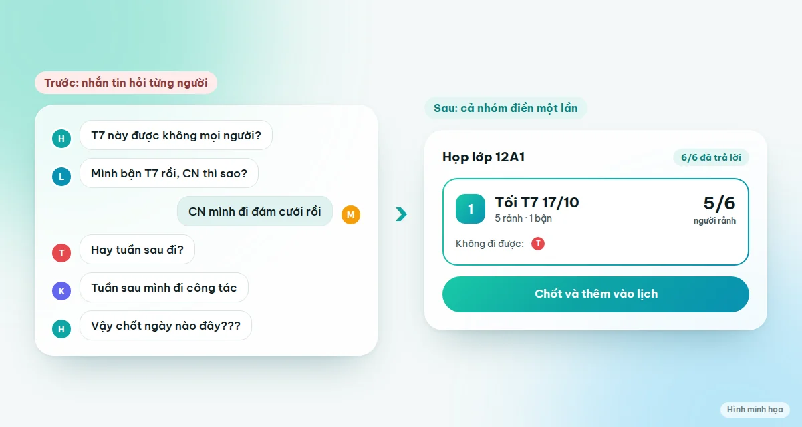
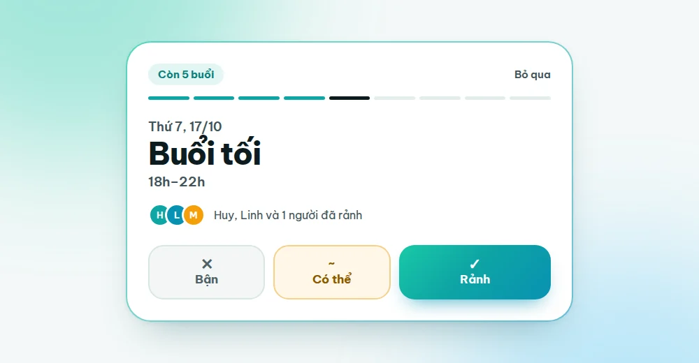
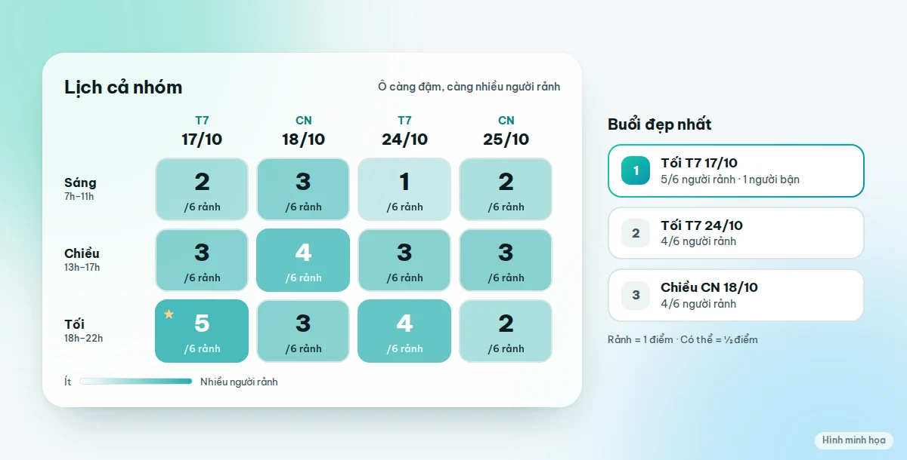

Chọn ngày cho cả nhóm khó không phải vì ai cũng bận, mà vì mỗi người chỉ biết lịch của mình và không ai nhìn thấy bức tranh chung. Cách nhanh nhất để chốt: **đừng hỏi "ngày nào được?" từng người, hãy cho cả nhóm cùng điền lịch rảnh vào một bảng**, rồi để bảng chỉ ra buổi có nhiều người đi được nhất.

Bài này gồm 5 nguyên tắc để chọn ngày không cãi nhau, và cách làm cụ thể trong khoảng 3 phút cho họp lớp, đi chơi cuối tuần hay chuyến du lịch nhiều ngày.

## Tóm tắt nhanh

1. Giới hạn khung thời gian (2–3 cuối tuần tới), đừng mở cả tháng.
2. Cho chọn theo buổi: sáng, chiều, tối.
3. Có ba mức trả lời: **Rảnh**, **Có thể**, **Bận**.
4. Đặt hạn chót trả lời và một người có quyền chốt.
5. Chọn buổi nhiều người đi được nhất, rồi xem ai không đi được.

## Vì sao cả nhóm hẹn mãi không chốt được ngày

Nếu bạn từng là người đứng ra rủ cả nhóm, chắc bạn đã gặp cảnh này:

- **Câu trả lời trôi trong tin nhắn.** Người trả lời "T7 được", người khác "CN thì sao", ba tiếng sau không ai nhớ ai đã nói gì.
- **Mỗi người đưa một ngày khác nhau.** Không có bảng tổng hợp, nên bạn phải tự đọc lại cả đoạn chat rồi ghi ra giấy.
- **Không ai có quyền chốt, cũng không có hạn chót.** Cả nhóm chờ nhau, cuối cùng chuyến đi hoặc buổi họp lớp bị đẩy sang tháng sau.

## 5 nguyên tắc để chọn ngày mà không cãi nhau

### 1. Giới hạn khung thời gian ngay từ đầu

"Tháng này ai rảnh ngày nào?" là câu hỏi quá rộng. Hãy đưa sẵn khung nhỏ, ví dụ hai cuối tuần liền kề. Ít lựa chọn thì người ta trả lời nhanh hơn và nhóm dễ chốt hơn.

### 2. Cho chọn theo buổi, không chỉ theo ngày

"Thứ 7 rảnh" chưa đủ thông tin. Người rảnh sáng thứ 7 chưa chắc rảnh tối thứ 7. Chia mỗi ngày thành **sáng, chiều, tối** (hoặc khung giờ cụ thể như 19h–21h) giúp bạn tìm được buổi thực sự trùng nhau, thay vì chọn một ngày rồi mới phát hiện nửa nhóm chỉ rảnh buổi khác.

### 3. Có ba mức trả lời, không chỉ "được" và "không"

Rất nhiều người chưa chắc chắn: "chắc rảnh, nhưng chờ xem lịch làm". Nếu chỉ có hai lựa chọn, họ sẽ trả lời bừa hoặc bỏ qua luôn. Thêm mức **Có thể** để họ trả lời thật, và khi tính, bạn coi Rảnh là 1 điểm, Có thể là nửa điểm.

### 4. Đặt hạn chót và giao quyền chốt cho một người

Không có hạn chót thì sẽ luôn có người trả lời muộn. Hãy đặt hạn 24–48 giờ, sau đó **một người** (thường là người tổ chức) có quyền chốt. Đây là điểm giúp nhóm không cãi nhau: mọi người đồng ý từ đầu rằng kết quả cuối do người đó quyết dựa trên bảng.

### 5. Chọn buổi nhiều người đi được nhất, rồi xem ai vắng

Buổi có điểm cao nhất chưa chắc là buổi tốt nhất nếu người vắng lại là nhân vật chính (cô giáo chủ nhiệm, người lớn tuổi, người ở xa). Hãy nhìn thêm danh sách **ai không đi được** ở từng buổi trước khi chốt.

<TemplateCta slug="chon-ngay-hop-lop" />

## Cách làm với Vote Đi trong 3 phút

Vote Đi có sẵn kiểu vote **Chọn lịch rảnh** đúng cho việc này. Cả nhóm không cần tạo tài khoản.

### Bước 1: Tạo phòng từ mẫu "Chọn ngày họp lớp"

Vào [mẫu Chọn ngày họp lớp](/mau/chon-ngay-hop-lop) và bấm **Dùng mẫu này**. Đặt tên phòng, ví dụ "Họp lớp 12A1".

### Bước 2: Chọn các ngày và buổi

Chọn những ngày bạn cân nhắc, rồi chọn chế độ:

- **Theo ngày**: hợp việc đơn giản, chỉ cần biết ngày nào rảnh.
- **Theo buổi**: chia mỗi ngày thành sáng, chiều, tối. Phù hợp nhất cho họp lớp.
- **Theo khung giờ**: dùng khi cần giờ cụ thể, ví dụ họp nhóm 19h–21h.
- **Chuyến đi nhiều ngày**: xem phần du lịch bên dưới.

### Bước 3: Gửi link vào nhóm Zalo

Sao chép link mời và gửi vào nhóm chat. Ai bấm vào chỉ cần **đặt tên và chọn avatar** là vào phòng được ngay, không phải đăng ký. Nếu muốn riêng tư hơn, bạn có thể bật mật khẩu cho phòng (mặc định là tắt).

### Bước 4: Mỗi người trả lời nhanh

Thẻ **Trả lời nhanh** hỏi từng buổi một. Mỗi lần chạm **Bận**, **Có thể** hoặc **Rảnh**, thẻ tự chuyển sang buổi kế tiếp. Người lười điền bảng cũng trả lời được hết trong chưa đầy một phút. Mỗi người còn có thể để lại ghi chú ngắn, như "mình chỉ rảnh sau 17h".

### Bước 5: Xem lịch cả nhóm và chốt

Khi mọi người trả lời, bạn sẽ thấy **lưới lịch cả nhóm**: ô càng đậm càng nhiều người rảnh, kèm **top 3 buổi đẹp nhất** và danh sách ai không đi được. Bấm **Chốt**, cả nhóm thấy kết quả, và bạn có thể **thêm vào Google Calendar** hoặc tải file lịch (.ics) để điện thoại tự nhắc.

Nếu một buổi chưa hợp lý, bạn có thể **mở lại** phòng để cả nhóm điều chỉnh, thay vì phải làm lại từ đầu.

## Chọn ngày đi du lịch nhiều ngày thì làm sao?

Đi du lịch khó hơn vì cần **nhiều ngày liền nhau** đều rảnh, không phải một ngày lẻ. Chế độ **Chuyến đi** giải quyết việc này: bạn chọn số ngày của chuyến đi, mỗi người tô những ngày mình đi được, rồi hệ thống tự tìm các **khung ngày liên tiếp** mà nhiều người đi được cả khung nhất.

Ví dụ nhóm 6 người định đi 3 ngày. Có người rảnh thứ 6 và thứ 7 nhưng bận chủ nhật, hệ thống sẽ không tính người đó vào khung thứ 6 đến chủ nhật, và cho bạn thấy khung nào khác hợp hơn. Bạn thử với [mẫu Chọn ngày đi du lịch](/mau/chon-ngay-di-du-lich).

<TemplateCta slug="chon-ngay-di-du-lich" />

## Các cách chốt ngày phổ biến: nên dùng cách nào?

| Cách | Hợp khi | Hạn chế |
|---|---|---|
| Nhắn tin hỏi từng người | Nhóm rất nhỏ, 2–3 người | Câu trả lời trôi, phải tự tổng hợp |
| Bình chọn có sẵn của Zalo | Câu hỏi ngắn, ít lựa chọn | Số phương án bị giới hạn, khó liệt kê nhiều buổi, không có mức "Có thể" |
| Google Forms hoặc bảng tính | Cần thu thập nhiều thông tin | Phải tự dựng, khó nhìn ra ai rảnh cùng lúc |
| Vote Đi (Chọn lịch rảnh) | Nhóm 4 người trở lên, nhiều ngày và buổi | Dùng trên trình duyệt, chưa có ứng dụng riêng |

Không có cách nào đúng cho mọi nhóm. Với vài người thì nhắn tin vẫn nhanh nhất. Khi nhóm từ 4 người trở lên hoặc có nhiều ngày để chọn, bảng chung sẽ đỡ rắc rối hơn nhiều.

## Mẹo riêng cho họp lớp

- **Hỏi sớm 3–4 tuần.** Người đi làm xa cần thời gian sắp xếp.
- **Đưa hai cuối tuần liền kề** thay vì một ngày duy nhất, để người bận có đường lùi.
- **Nhờ 2–3 bạn làm đầu mối** nhắc trong nhóm nhỏ của họ. Nhắc riêng hiệu quả hơn nhắc chung.
- **Tránh dịp lễ và mùa cưới** nếu không cần thiết.
- **Chốt ngày trước, chốt địa điểm sau.** Khi đã có ngày, bạn dễ mời cả nhóm chọn địa điểm bằng [mẫu Đi đâu chơi cuối tuần](/mau/di-dau-choi-cuoi-tuan).
- **Chụp kết quả gửi lại nhóm** sau khi chốt để mọi người cùng nhớ.

Đi teambuilding cho công ty thì dùng [mẫu Chọn ngày teambuilding](/mau/chon-ngay-teambuilding), họp định kỳ thì dùng [mẫu Chọn giờ họp team](/mau/lich-hop-team).

## Câu hỏi thường gặp

### Cả nhóm có phải tạo tài khoản không?

Không. Mỗi người bấm link mời, đặt tên và chọn avatar là vào phòng được ngay.

### Vote Đi có miễn phí không?

Miễn phí. Bạn tạo phòng, mời người và vote mà không mất phí.

### Có chọn được giờ cụ thể, không chỉ sáng, chiều, tối?

Có. Chế độ **Khung giờ** cho phép bạn đặt khung như 19h–21h. Còn nếu chỉ cần biết ngày, bạn chọn chế độ **Theo ngày**.

### Hai buổi có số người rảnh bằng nhau thì chốt buổi nào?

Bảng hiển thị rõ ai không đi được ở từng buổi, nên người tổ chức có thể chọn buổi mà người quan trọng không bị vắng. Kết quả cuối do chủ phòng chốt.

### Có thể để mọi người điền ẩn danh không?

Có. Khi bật chế độ ẩn danh, không ai thấy ai chọn gì, kể cả chủ phòng. Bạn chỉ thấy số lượng tổng hợp.

### Chốt xong có được nhắc lịch không?

Sau khi chốt, bạn thêm sự kiện vào **Google Calendar** hoặc tải file **.ics** để điện thoại tự nhắc trước giờ hẹn.

### Nếu có người trả lời muộn hoặc muốn đổi ý?

Mọi người đổi câu trả lời thoải mái cho đến khi chủ phòng chốt. Nếu đã chốt mà cần điều chỉnh, chủ phòng có thể mở lại phòng.

## Bắt đầu chốt ngày cho nhóm của bạn

Tạo phòng mất chưa tới một phút, gửi link vào nhóm, và để bảng tự chỉ ra buổi nhiều người đi được nhất.

<TemplateCta slug="chon-ngay-hop-lop" />
