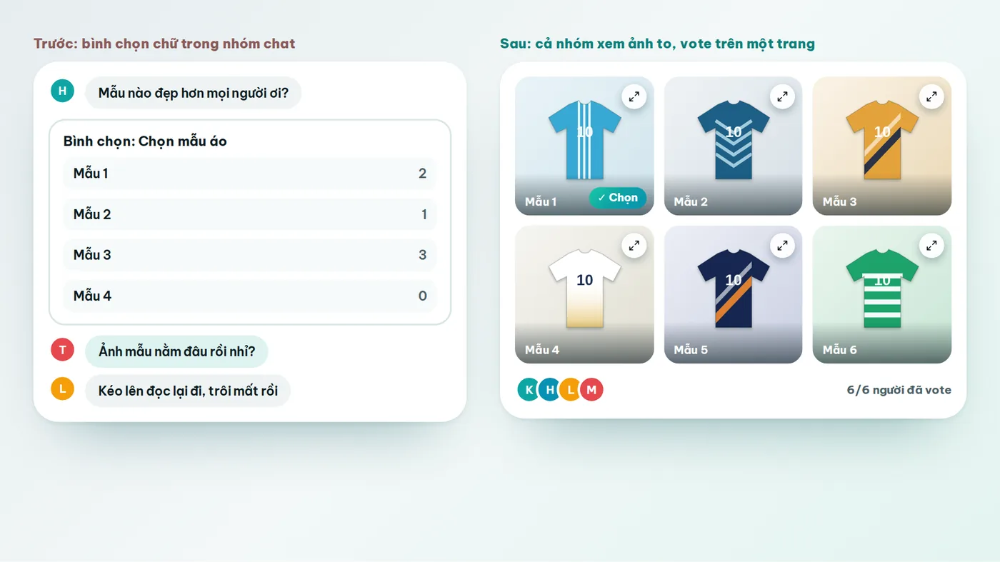
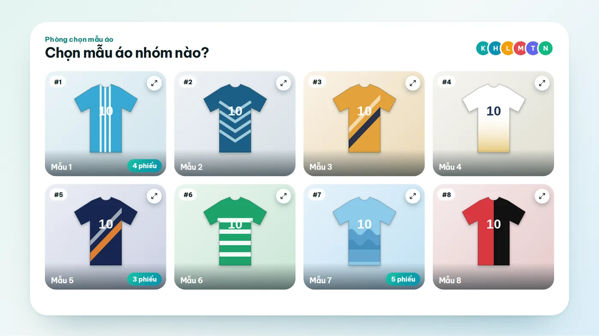
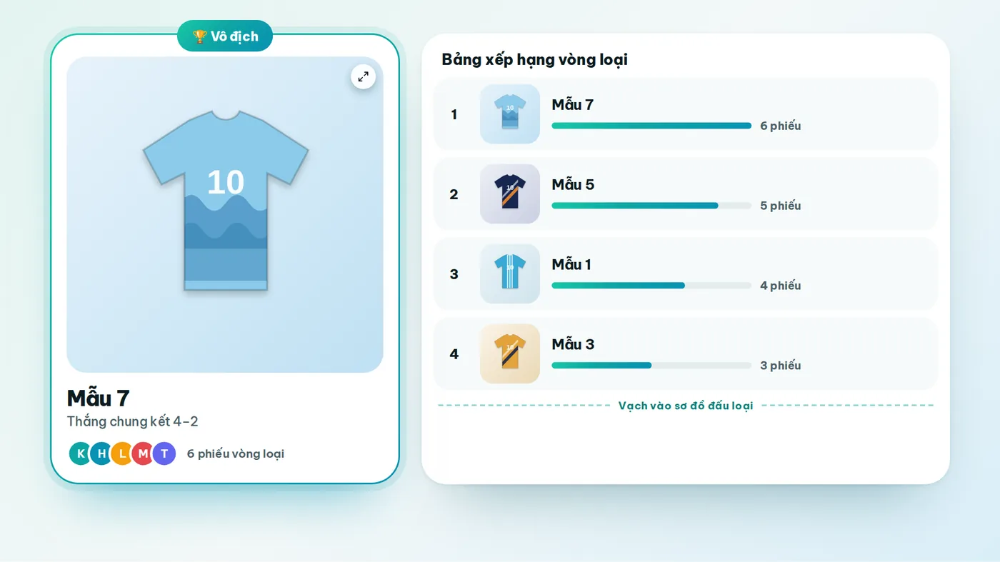
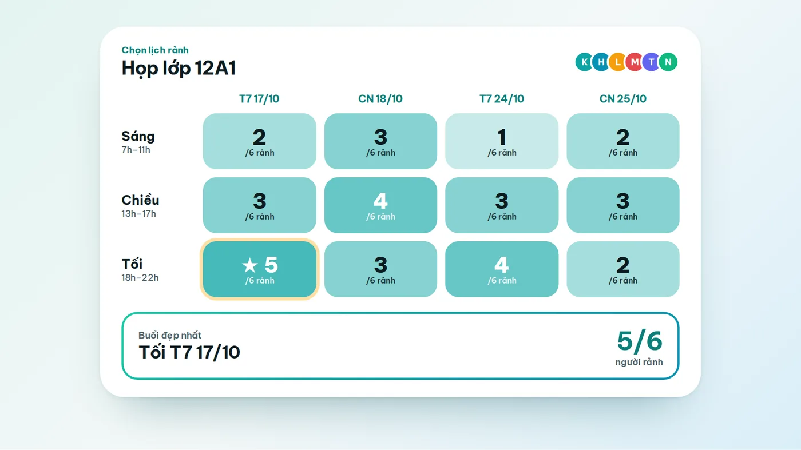

Cứ đến lúc cả nhóm phải đồng lòng về một chuyện gì đó, tin nhắn lại bắt đầu trôi như thác. Đội bóng cần đặt áo mới thì có người thích màu xanh, có người đòi màu đen, và đến nửa đêm lại có thêm ba mẫu nữa được gửi vào. Lớp muốn họp mặt thì ai cũng bảo "để mình xem lịch đã", rồi hai tuần sau thứ duy nhất cả nhóm chốt được là cái nhóm chat đang có ba trăm tin chưa đọc.

Hai việc này, chọn mẫu áo (hoặc logo) và tìm ngày cả nhóm cùng rảnh, nghe thì khác nhau nhưng gốc rễ lại giống nhau. Cả hai đều cần một chỗ chung để mọi người nhìn thấy cùng một thứ và bấm chọn, thay vì mỗi người nói một nơi. Bài này chúng mình đi qua sáu cách tạo vote cho nhóm đang có, nói thật cách nào hợp với việc nào, kể cả những chỗ Vote Đi, web chính chúng mình làm, còn chưa hoàn hảo.

## Nếu bạn đang vội

Chọn áo, chọn logo hay bất cứ thứ gì cần nhìn ảnh cho kỹ thì nên dùng một trang vote cho xem ảnh to và cho bỏ phiếu ẩn danh. Chốt ngày thì dùng một bảng lịch để mỗi người tô những buổi mình rảnh. Bình chọn có sẵn trong Zalo vẫn rất ổn khi chỉ có vài phương án bằng chữ, kiểu "trưa nay ăn lẩu hay bún bò". Còn nếu bạn cần cả hai việc trong cùng một đường link, không bắt ai tạo tài khoản, hãy xem phần về Vote Đi ở giữa bài và bảng so sánh bên dưới rồi tự quyết.

## Vì sao chọn áo nhóm và chốt ngày lại dễ thành "cuộc chiến"

### Chọn áo là chuyện của con mắt, và của cả cái tôi

Mẫu áo là thứ người ta nhìn chứ không ai đọc. Một dòng "mẫu 3 đẹp hơn" mà không kèm ảnh thì chẳng ai biết mẫu 3 nằm ở đâu, nên cả nhóm phải kéo ngược lên đoạn chat cũ để tìm, được vài lần là chán. Tệ hơn, áo là thứ mặc lên người, nên ai cũng có ý kiến nhưng không phải ai cũng dám nói thẳng. Khi phiếu bầu hiện rõ tên từng người, nhiều bạn sẽ chọn theo mẫu của anh đội trưởng hay cô lớp trưởng cho yên chuyện, và mẫu cả nhóm thật lòng thích lại bị chìm.

Còn một cái bẫy nữa là số lượng. Khi có mười lăm, hai mươi mẫu mà bỏ phiếu một lượt, phiếu bị chia nhỏ đến mức mẫu thắng chỉ hơn mẫu thua đúng một phiếu, và chẳng ai thấy phục.

### Chốt ngày thì mỗi người bận một kiểu

Chuyện ngày giờ khó ở chỗ mỗi người chỉ biết lịch của mình, không ai nhìn thấy bức tranh chung. Câu "thứ 7 được" nghe rất rõ ràng nhưng thiếu mất vế quan trọng nhất là sáng hay tối. Có bạn thì "chắc là rảnh, nhưng chờ lịch trực", một câu trả lời lửng lơ không nằm vừa trong ô "được" hay "không". Cuối cùng người đứng ra tổ chức phải ngồi đọc lại cả đoạn chat rồi ghi tay ra giấy. Phần này chúng mình đã viết kỹ trong bài [cách chọn ngày đi chơi, họp lớp cả nhóm không cãi nhau](/blog/chon-ngay-di-choi-hop-lop-ca-nhom), bạn đọc thêm nếu việc chốt ngày là chuyện chính của nhóm.

## Một công cụ tạo vote cho nhóm nên có những gì

Trước khi so sánh, cần thống nhất xem thế nào là "tốt". Từ lúc làm Vote Đi đến giờ, chúng mình thấy có năm điều quyết định một cuộc vote có trơn tru hay không:

1. Người tham gia vào được bằng một đường link, không phải cài thêm ứng dụng hay tạo tài khoản. Chỉ cần một người ngại là cả nhóm lại phải nhắc nhau từng bước.
2. Xem được ảnh to và phóng lên để nhìn họa tiết, đường may, chữ nhỏ. Với mẫu áo và logo thì điều này gần như bắt buộc.
3. Có chế độ ẩn danh, để người ta chọn theo ý mình chứ không theo ý người đứng đầu nhóm.
4. Kết quả dễ đọc, ai nhìn cũng hiểu mẫu nào đứng đầu và vì sao, thay vì phải đếm tay trong đoạn chat.
5. Có bước chốt rõ ràng. Vote xong phải có một kết quả cuối để cả nhóm cùng nhìn, kèm một người có quyền quyết khi hai phương án bằng điểm nhau.

## Sáu cách tạo vote cho nhóm: ưu và nhược điểm

Chúng mình không cố nói cách nào cũng tuyệt. Nếu nhóm bạn chỉ có năm người và cần chọn quán ăn trưa nay thì chẳng cần cài thêm gì cả. Dưới đây là sáu cách phổ biến, đi từ cách nhiều người đã quen đến cách chuyên dụng hơn.

### 1. Bình chọn có sẵn trong Zalo

Zalo cho tạo bình chọn ngay trong nhóm chat. Theo các trang hướng dẫn hiện có, mỗi phương án là một dòng chữ ngắn, và bạn có thể bật chế độ ẩn người bình chọn, cho chọn nhiều đáp án hoặc cho thành viên tự thêm phương án. Điểm mạnh lớn nhất là ai cũng có Zalo sẵn, khỏi phải rủ ai làm gì thêm.

Chỗ khó nằm ở chữ "dòng chữ" kia. Muốn so sánh mẫu áo thì bạn vẫn phải gửi ảnh riêng, rồi ảnh trôi đi, rồi phương án "Mẫu 2" trong bảng bình chọn và tấm ảnh nó nói tới không còn nằm gần nhau nữa. Bình chọn cũng không có bảng theo buổi để chốt ngày. Cách này hợp nhất với những câu hỏi ngắn, ba bốn phương án. Zalo cập nhật tính năng theo từng phiên bản, nên bạn kiểm tra lại trong ứng dụng của mình cho chắc.

### 2. Poll trong Messenger, Telegram và các app nhắn tin khác

Messenger và Telegram cũng cho tạo poll ngay trong nhóm chat, cách dùng gần giống Zalo. Ưu điểm và nhược điểm vì thế cũng gần giống: tiện nếu cả nhóm vốn đã sống sẵn trên app đó, nhưng phương án chủ yếu là chữ và kết quả nằm lẫn trong dòng tin nhắn. Nếu nhóm bạn dùng nhiều app khác nhau, chẳng hạn học sinh ở Zalo còn phụ huynh ở Messenger, thì một poll trong chat sẽ không với tới được tất cả mọi người.

### 3. Google Forms

Google Forms miễn phí, rất linh hoạt và đổ dữ liệu thẳng vào bảng tính. Bạn có thể thêm ảnh vào câu hỏi, cả vào từng lựa chọn, nên chọn mẫu áo bằng Forms là làm được. Có một điểm cộng ít người nghĩ tới: Forms cực kỳ hợp cho bước sau khi đã chốt mẫu, lúc cần thu cỡ áo, số lượng và tên in của từng người.

Nhưng để làm một cuộc vote thì Forms hơi thiếu không khí chung. Người trả lời mở biểu mẫu, điền xong rồi đóng lại, không thấy ai khác đã chọn gì (trừ khi bạn công khai kết quả), còn bạn thì phải tự dựng và tự đọc biểu đồ. Vòng đấu loại hay xếp hạng gần như không làm được, còn chốt ngày theo buổi thì phải tự nghĩ cách bố trí bảng.

### 4. When2meet, Doodle, Rallly: chuyên cho ngày giờ

Ba cái tên này dùng chủ yếu để tìm giờ họp. When2meet miễn phí, không cần tài khoản, người tham gia kéo chuột tô những khung giờ mình rảnh, nổi tiếng vì đơn giản dù giao diện khá cũ. Doodle là cái tên lâu đời nhất, nhưng theo các trang đánh giá công cụ năm 2026, gói miễn phí bị giới hạn số cuộc thăm dò mở cùng lúc và có quảng cáo. Rallly là lựa chọn mã nguồn mở, bản miễn phí đủ dùng cho nhóm nhỏ.

Cả ba đều làm tốt việc tìm giờ chung, nhưng giao diện bằng tiếng Anh và không có chỗ nào cho ảnh, nên chọn mẫu áo hay logo thì không dùng được. Giá và giới hạn của các dịch vụ này đổi khá thường xuyên, bạn nên xem lại trang chính thức trước khi quyết định.

### 5. Tự dựng bằng Google Sheets hoặc bảng giấy

Với nhóm nhỏ và một người đủ kiên nhẫn, một bảng tính chung vẫn chạy được: mỗi cột là một buổi, mỗi người gõ tên vào buổi mình rảnh. Chi phí bằng không, ai muốn chỉnh gì cũng chỉnh được. Chính vì ai cũng chỉnh được nên mới có chuyện lỡ tay xóa nhầm cột, hay người này vô tình sửa ô của người kia. Bảng tính cũng không ẩn danh được, và với mẫu áo thì chèn ảnh vào ô trông khá chật chội.

### 6. Vote Đi

Phần này chúng mình thiên vị một chút, bạn cứ đọc với con mắt tỉnh táo. Vote Đi là web tạo vote cho nhóm, chạy ngay trên trình duyệt điện thoại hay máy tính. Bạn tạo phòng, đặt tên, tải ảnh mẫu lên (JPG, PNG hoặc WEBP, mỗi ảnh tối đa 10MB, tối đa 32 mẫu) rồi gửi đường link vào nhóm. Ai bấm vào chỉ cần đặt tên và chọn avatar là vào được, không phải tạo tài khoản.

Với mẫu áo và logo, ảnh nào cũng có nút phóng to để nhìn cho kỹ, và bạn chọn một trong sáu [kiểu vote](/kieu-vote): bình chọn nhanh, đấu loại kiểu World Cup, quẹt chọn, xếp hạng, chấm điểm hoặc chọn lịch rảnh. Khi có nhiều mẫu, phòng chạy một vòng loại trước rồi mới đưa các mẫu cao điểm nhất vào sơ đồ đấu loại, để mẫu thắng cuối cùng thật sự đã qua nhiều lượt so sánh. Bạn bật được chế độ ẩn danh, và khi bật thì không ai thấy ai chọn gì, kể cả chủ phòng. Còn với ngày giờ, kiểu chọn lịch rảnh cho mỗi người tô buổi mình rảnh vào một lưới chung rồi tự xếp ra những buổi nhiều người đi được nhất.

Chỗ chưa hoàn hảo cũng nên nói thẳng. Vote Đi chạy trên trình duyệt, chưa có ứng dụng riêng, và chưa gắn thẳng vào Zalo nên bạn vẫn phải gửi link vào nhóm. Web còn mới, chưa quen mặt với mọi người như bình chọn có sẵn của Zalo. Với những nhóm chỉ cần hỏi nhanh một câu, dùng bình chọn có sẵn vẫn tiện hơn.

<TemplateCta slug="chon-mau-ao-nhom" />

## Bảng so sánh nhanh

Bảng dưới gom lại những gì đã nói ở trên, để bạn đối chiếu theo nhu cầu của nhóm.

| Cách làm | Chọn áo, logo bằng ảnh | Chốt ngày rảnh | Người tham gia cần gì | Hợp nhất khi |
|---|---|---|---|---|
| Bình chọn trong Zalo | Phương án là chữ, ảnh phải gửi riêng | Không có bảng theo buổi | Có Zalo, ở trong nhóm | Câu hỏi nhanh, ít phương án |
| Poll Messenger, Telegram | Tương tự, chủ yếu là chữ | Không có bảng theo buổi | Có app, ở trong nhóm | Nhóm vốn đã dùng sẵn app đó |
| Google Forms | Thêm được ảnh vào lựa chọn | Phải tự dựng | Mở link biểu mẫu | Cần thu cỡ áo, số lượng, tên in |
| When2meet, Doodle, Rallly | Không làm được | Làm tốt, giao diện tiếng Anh | Mở link | Tìm giờ họp cho nhiều người |
| Bảng tính chung | Tự chèn ảnh, khá chật | Tự kẻ bảng | Có quyền sửa file | Nhóm nhỏ, có người kiên nhẫn |
| Vote Đi | Ảnh phóng to, 6 kiểu vote, ẩn danh | Lưới lịch, top buổi đẹp nhất, thêm vào Google Calendar | Mở link, đặt tên, chọn avatar | Cần cả chọn mẫu lẫn chốt ngày, nhóm từ 4 người |

Không có cách nào thắng ở mọi cuộc. Nếu việc của nhóm chỉ là một câu hỏi nhanh thì Zalo vẫn đủ dùng. Còn khi cần vừa so sánh ảnh vừa chốt ngày trong cùng một việc, bạn nên chọn công cụ làm được cả hai, thay vì ghép ba bốn cách rời nhau rồi tự gom kết quả.

## Chọn áo nhóm mà không cãi nhau: quy trình chúng mình thấy ổn

Công cụ chỉ là một nửa chuyện. Nửa còn lại là cách bạn chuẩn bị cuộc vote, và phần này áp dụng được cả khi bạn không dùng Vote Đi.

### Bước 1: Thu hẹp trước khi cho cả nhóm vote

Người tổ chức nên lọc trước, còn khoảng sáu đến mười hai mẫu: bỏ những mẫu quá ngân sách, mẫu chất liệu không hợp, mẫu in thử bị lỗi. Cả nhóm không cần xem lại những mẫu mà ai cũng biết là sẽ không dùng. Nếu được, hãy ghi luôn giá và chất liệu bên cạnh mỗi mẫu, để người vote khỏi phải hỏi lại trong nhóm.

### Bước 2: Đặt tên trung lập cho từng mẫu

"Mẫu 1, Mẫu 2" tốt hơn "Mẫu của anh Hưng". Khi tên người đề xuất hiện ra, phiếu bầu rất dễ biến thành chuyện nể nang. Tên trung lập giúp mọi người chọn bằng mắt, đúng với điều bạn muốn.

### Bước 3: Chọn kiểu vote theo số lượng mẫu

Khoảng sáu mẫu trở xuống thì bình chọn nhanh là đủ. Nhiều mẫu hơn thì nên cho một vòng loại, sau đó đấu loại, vì mỗi lần chỉ phải so hai mẫu với nhau nên người ta dễ quyết hơn rất nhiều. Muốn biết mẫu nào được yêu thích đều thì dùng xếp hạng. Còn nếu nhóm có người hay nể, hãy bật ẩn danh ngay từ đầu.

### Bước 4: Đặt hạn chót và giao quyền chốt

Hai mươi bốn đến bốn mươi tám giờ là khoảng thời gian hợp lý: đủ để người bận kịp vào, và đủ gấp để không ai quên. Hãy nói trước với cả nhóm rằng khi hai mẫu bằng điểm, một người cụ thể (thường là người tổ chức) sẽ quyết. Biết trước luật chơi thì sau đó ít ai phản đối.

### Bước 5: Chốt xong thì thu cỡ áo và báo lại nhóm

Kết quả vote chỉ quyết định mẫu áo. Phần cỡ áo, số lượng và tên in vẫn cần thu riêng, và đây chính là chỗ Google Forms phát huy tác dụng. Đừng quên gửi ảnh kết quả vào nhóm để mọi người cùng nhớ rằng mẫu này là do cả nhóm chọn.

<TemplateCta slug="chon-mau-ao-lop" />

## Chốt ngày rảnh cho cả nhóm trong vài phút

Cách làm gần giống chọn áo, chỉ khác ở chỗ thay vì xem ảnh, mỗi người tô những buổi mình rảnh. Mỗi buổi nên có ba mức trả lời là rảnh, có thể và bận, vì nhiều người chưa chắc chắn và sẽ trả lời bừa nếu chỉ có hai lựa chọn. Khi mọi người trả lời xong, lưới lịch chung sẽ cho thấy ô nào đậm nhất, tức là buổi có nhiều người đi được nhất, và bạn chốt luôn tại đó. Đừng quên xem cả danh sách những ai không đi được ở buổi ấy trước khi quyết, vì buổi đông nhất chưa chắc là buổi tốt nhất nếu người vắng lại là cô giáo chủ nhiệm.

Nếu bạn đang phân vân giữa nhiều việc cùng lúc, chốt ngày trước rồi mới chốt địa điểm sẽ nhẹ đầu hơn. Bạn có thể bắt đầu từ [mẫu Chọn ngày họp lớp](/mau/chon-ngay-hop-lop), sau đó dùng [mẫu Đi đâu chơi cuối tuần](/mau/di-dau-choi-cuoi-tuan) hoặc [mẫu Hôm nay ăn gì](/mau/hom-nay-an-gi) cho những câu hỏi nhỏ hơn.

<TemplateCta slug="chon-ngay-hop-lop" />

## Những lỗi hay gặp khi tạo vote cho nhóm

**Cho quá nhiều lựa chọn cùng lúc.** Người ta xem được năm sáu mẫu thì còn tập trung, đến mẫu thứ hai mươi thì bắt đầu chọn bừa. Nếu nhiều mẫu thật, hãy cho đấu loại để mỗi lượt chỉ phải so hai mẫu.

**Để lộ ai chọn gì khi nhóm có người nể.** Một nhóm bạn thân thì không sao, nhưng khi có thầy cô, người lớn tuổi hay cấp trên trong nhóm, phiếu công khai thường kéo kết quả lệch về phía họ. Ẩn danh là cách đơn giản nhất để tránh chuyện đó.

**Không có hạn chót, cũng không có người chốt.** Vote kéo dài vô hạn thì sẽ luôn có người vào muộn rồi đòi đổi. Hãy đặt hạn và nói rõ ai là người quyết ngay từ đầu.

**Gửi link rồi để đó.** Trong nhóm đông, hầu hết mọi người sẽ lướt qua tin nhắn có link. Nhắc riêng từng người chưa vote có tác dụng hơn nhiều so với nhắc chung cả nhóm.

**Chốt xong mà không báo lại.** Một tấm ảnh chụp kết quả gửi vào nhóm mất ba giây, nhưng tránh được những câu hỏi kiểu "rồi cuối cùng mình chọn mẫu nào vậy" xuất hiện sau đó một tuần.

## Câu hỏi thường gặp

### Web nào tạo vote cho nhóm miễn phí, không cần đăng ký?

Có vài lựa chọn. Bình chọn có sẵn trong Zalo hay Messenger không cần cài gì thêm, When2meet cho tìm giờ rảnh không cần tài khoản, còn Vote Đi cho cả nhóm vào bằng link, chỉ cần đặt tên và chọn avatar. Tính năng và giới hạn của mỗi nơi khác nhau, bảng so sánh ở trên sẽ giúp bạn chọn đúng việc.

### Tạo vote chọn mẫu áo cho lớp, cho đội bóng như thế nào?

Lọc trước còn khoảng sáu đến mười hai mẫu, đặt tên trung lập, tải ảnh lên một trang vote cho xem ảnh to, gửi link vào nhóm và đặt hạn chót. Nếu nhiều mẫu thì dùng vòng loại rồi đấu loại, bạn có thể bắt đầu từ [mẫu Chọn mẫu áo nhóm](/mau/chon-mau-ao-nhom) hoặc [mẫu Chọn áo lớp](/mau/chon-mau-ao-lop).

### Bình chọn trong Zalo có đủ để chọn mẫu áo không?

Đủ nếu chỉ có vài mẫu và cả nhóm đã xem ảnh ở đâu đó rồi. Nhưng phương án trong bình chọn Zalo là chữ, nên ảnh và phiếu bầu nằm tách nhau và dễ bị trôi. Khi có nhiều mẫu hoặc cần xem ảnh to, một trang vote chuyên cho ảnh sẽ dễ hơn.

### Vote ẩn danh có thật sự ẩn không?

Với Vote Đi, khi chủ phòng bật chế độ ẩn danh thì không ai thấy ai chọn gì, kể cả chủ phòng. Mọi người chỉ nhìn thấy số lượng phiếu tổng hợp. Nếu không bật, kết quả sẽ hiện ai đã vote cho bên nào.

### Chốt ngày rảnh cho cả nhóm bằng cách nào nhanh nhất?

Dùng một bảng lịch chung để mỗi người tô những buổi mình rảnh, thay vì nhắn hỏi từng người. Bảng sẽ cho thấy buổi nào nhiều người đi được nhất, và bạn chốt tại đó. Cách làm chi tiết có trong bài [chọn ngày đi chơi, họp lớp cả nhóm không cãi nhau](/blog/chon-ngay-di-choi-hop-lop-ca-nhom).

### Nhóm có người không rành công nghệ thì sao?

Họ chỉ cần bấm vào đường link, đặt tên và chọn avatar rồi chạm vào mẫu mình thích, không phải tạo tài khoản hay cài ứng dụng. Nếu vẫn có người ngại, bạn có thể nhắn riêng cho họ kèm link, hoặc ngồi cạnh hướng dẫn một lần đầu cho quen.

## Bắt đầu với nhóm của bạn

Chọn áo hay chốt ngày thì cuối cùng cũng chỉ là chuyện làm sao để cả nhóm cùng nhìn thấy một thứ và cùng bấm chọn. Nếu bạn muốn thử, tạo một phòng chỉ mất chưa tới một phút: tải mấy mẫu áo lên, gửi link vào nhóm, rồi xem cả nhóm bỏ phiếu. Trong lúc chờ, bạn xem thêm [các mẫu có sẵn](/mau) cho nhiều tình huống khác như chọn logo, chọn quán ăn hay chọn địa điểm đi chơi.

<TemplateCta slug="chon-mau-ao-nhom" />
